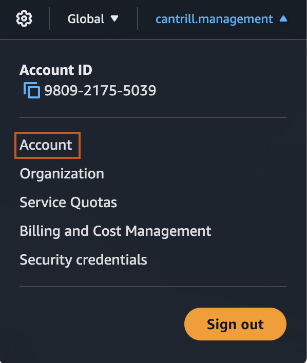
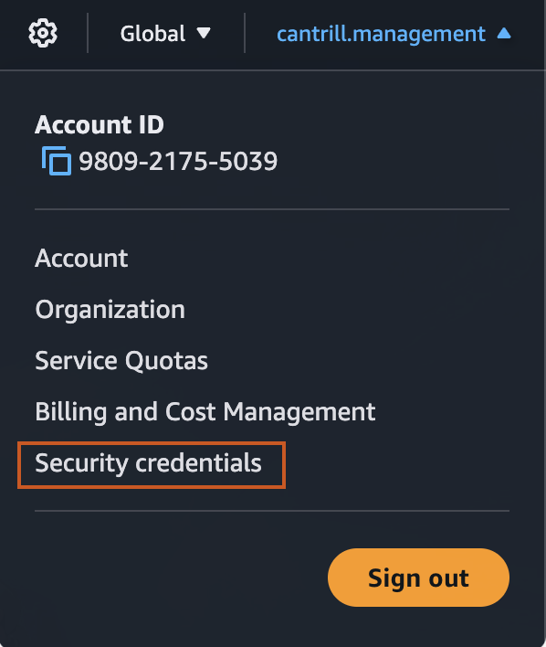
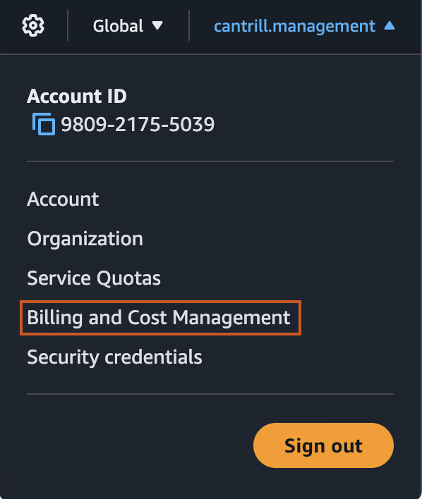
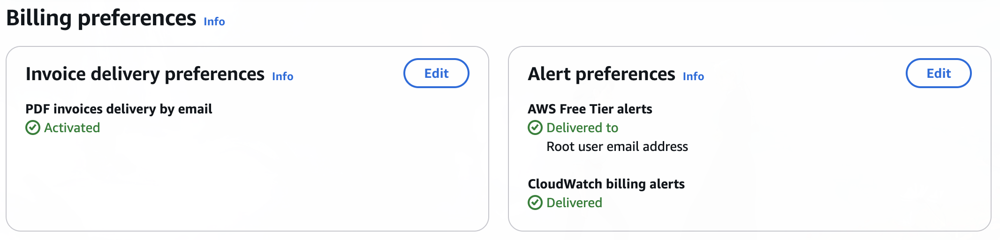

<h1 align="center"> AWS Certified Solutions Architect – Associate (SAA-C03) </h1>

---

## 1. Course Fundamentals and AWS Accounts

### Creating general(management) account

1. we can use email alias to create multiple accounts in aws
  eg: user.aws+management@proton.me

1. Signup for a root account

1. Signin using the account email & password

1. Activate IAM Access
    - Go to `Account`

      

    - Enter alternate contacts (optional)

    - Under `IAM User and Role Access to Billing Information` section check the `Activate IAM Access` option

1. Use the Region as `N.Virginia`

1. Activate MFA

    

---

### Creating Alerts to email

1. Go to `Billing and Cost Management`

    

1. Enable PDF invoices to email

    - Click on `Billing Preferences`
    - Click edit button on `Invoice delivery preferences` box
    - Check the `PDF invoices delivered by email` checkbox and click Update button

1. Enable Free tier alerts

    - Click edit button on `Alert preferences` box
    - Select both `Receive AWS Free Tier alerts` and `Receive CloudWatch billing alerts` checkboxes

  

   after activate both options you'll see above output 

---

### Creating Budget

1. Go to `Billing and Cost Management`

    

1. Click on `Create a Budget` button
    - Budget Setup - `Use a Template`
    - Templates - `Zero spend budget`

1. Give a name and Email recipients to the Budget

1. Click on `Create Budget`

---

### IAM

1. IAM allows to create 3 different objects
  1. User
  1. Group
  1. Roles

1. IAM has no cost (but has limitations)

1. IAM is a `Global service` / `Global resilience`

1. Allows or Deny its identities on its AWS accounts

1. No direct control on external users

1. Identity federation and MFA

### Add IAMADMIN to root account

1. Search for `IAM` in AWS console

1. On the sidebar click on `Users` under `Access Management`

1. Click on `Create user`

1. Provide a username

1. Check the `Provide user access to the AWS Management Console - optional` option

1. Add a custom password and click `Next`

1. Under `Set permissions` check the `Attach policies directly` option
    - Under `Permissions policies` check `AdministratorAccess` policy and click `Next`

1. Open the console url and type username and password 

1. Set up MFA like we did for root user [here](#creating-generalmanagement-account)

--- 

### Creating Access keys and setting up AWS CLI v2

1. Click on `Security credentials`

    

1. Scroll and click on `Create access key` 
    - Select `Command Line Interface (CLI)` option and click `Next`
    - Download .csv file

1. Install AWS CLI v2 as per [instructions](https://docs.aws.amazon.com/cli/latest/userguide/getting-started-install.html)

1. Run `aws configure --profile iamadmin-management`
    - Try running `aws s3 ls --profile iamadmin-management` to make sure you're not getting any errors

---

## 2. AWS Fundamentals

### AWS Public vs Private Services

---

### AWS Global Infrastructure

---

### EC2 (Elastic compute cloud) 

1. Search for `ec2` on aws console.

1. Create a key pair
    - select `Key pairs` on left sidebar menu
    - key pair type - `RSA`
    - Private key file format - `.pem` (for linux, macos and modern windows)

1. Launch an instance 
    - select `instances` on left sidebar
    - select `Launch instances`

---

### S3 Basics

1. Global storage platform - regional based/resilient

1. public service, unlimited data & multi-user

1. Can store Movies, Photos, Audio , Large data sets etc

1. Objects & Buckets
    - object consist of key and value
    - size range from 0 bytes - 5 TB
    - Bucket data saved to a specific region and it never leaves that region unless we configure it
    - Bucket name should be globally unique
    - A bucket can hold zero to unlimited number of objects
    - S3 bucket has no complex structure, all objects stored in the same level (no nested objects)
    - folder names are just prefixes
    - Buckets creation has 100 soft limit and 1000 hard limit per account

1. Deleting a Bucket
    - two step process
      1. Empty the bucket
      2. Delete the bucket

---

### CloudFormation (CFN) Basics

1. Can create stacks

---

### CloudWatch (CW) Basics

1. collects and manages operational data

1. can be think as 3 producss
  1. Metrics - disk usage, cpu utilization
  1. Cloudwatch logs - webserver logs, firewall logs
  1. Cloudwatch events

---

### Shared Responsibility Model

---

### High-Availability vs Fault-Tolerance vs Disaster Recovery

1. High-Availability(HA) - remain operational, with minimal downtime in the event of disruption (minimize any outages)

1. Fault-Tolerance(FT) - remain operational with zero downtime in the event of disruption (Operate through Faults)
    - Complex system to design
    - often very expensive

1. Disaster Recover (DR) - restoring operations after a disruption (used when HA or FT don't work)

---

### Route53

1. Register domains

1. Its a global service

